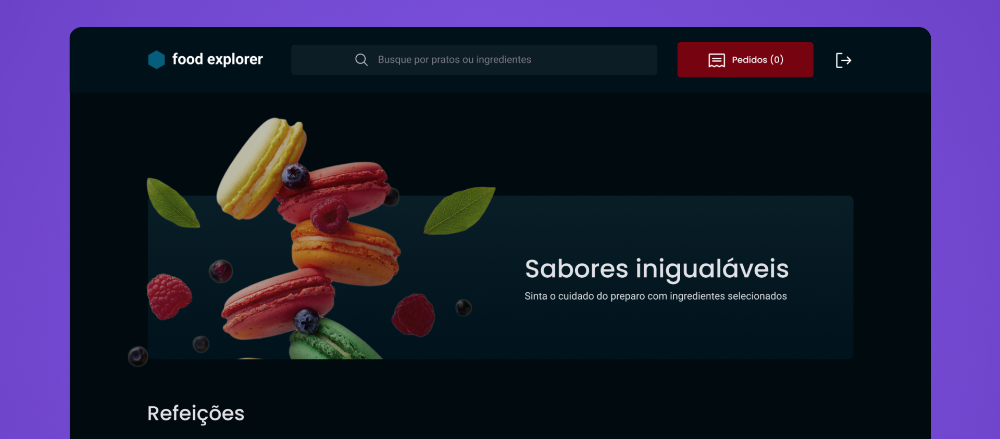

# FOOD EXPLORER
Food Explorer é uma aplicação desenvolvida em React.js e outras tecnologias, que permite aos clientes de restaurantes navegar e fazer pedidos de alimentos de forma simples e eficiente. O design da aplicação é baseado no Figma, garantindo uma experiência agradável e intuitiva aos usuários.

BackEnd: https://github.com/eduardovjesus/foodexplorer-back
Deploy: https://celadon-gumption-aa24aa.netlify.app/

## 📘 Ferramentas/Bibliotecas utilizadas
- React
- React Router DOM
- Styled Components
- Axios
- React Icons
- Vite


## 🎨 Layout
A página inicial em formato desktop é vista na imagem abaixo:



___

### 💻 Executando o FrontEnd
```bash
# Navegue até o diretório do FrontEnd
$ cd ./foodexplorer-front

# Instale as dependências necessárias
$ npm install

# Agora inicie o servidor do FrontEnd
$ npm run dev
```

```bash
# Perfil do usuário - você pode criar o seu também
usuário: user@email.com
senha: 123456
```

## ✔️ Autores

- [Eduardo Vieira](https://github.com/eduardovjesus/)

## 📄 Referência

- [Rockeseat](https://www.rocketseat.com.br/)

